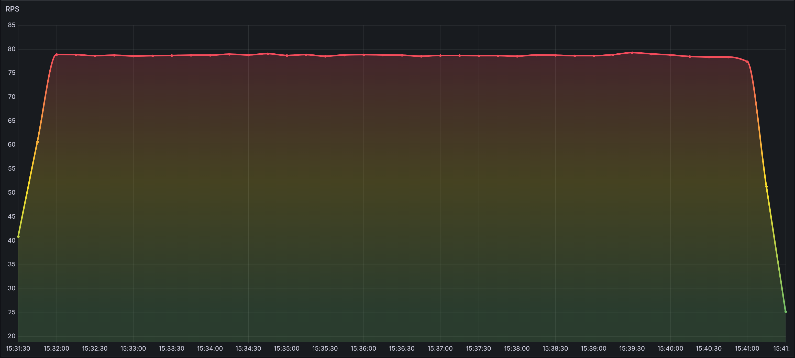
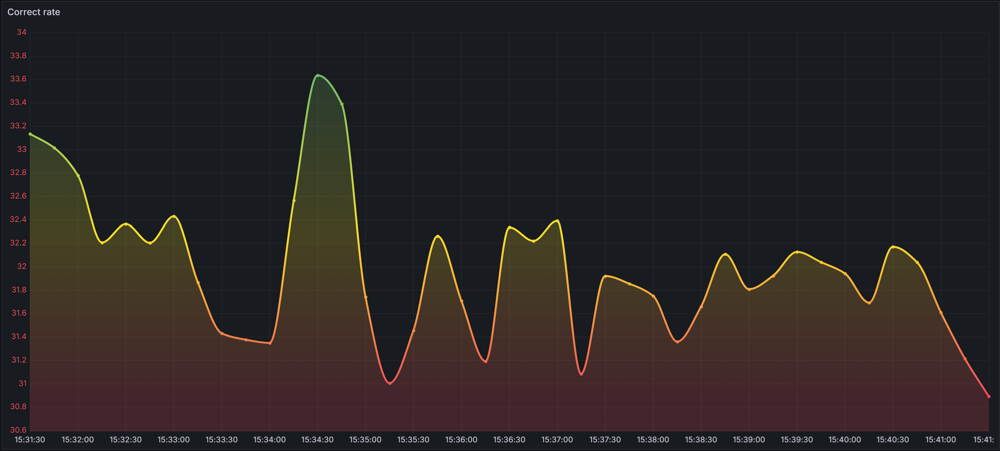
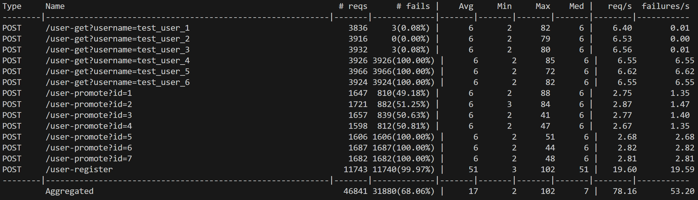

# Python Backend

## HW 1

Скрипт для запуска приложения: `uvicorn HW_1.app:app`.

## HW 2

Скрипт для запуска приложения: `uvicorn HW_2.main:app`.

## HW 3

**Дашборды**

## HW 4

**RPS**

**Correct rate**

**locust report**

